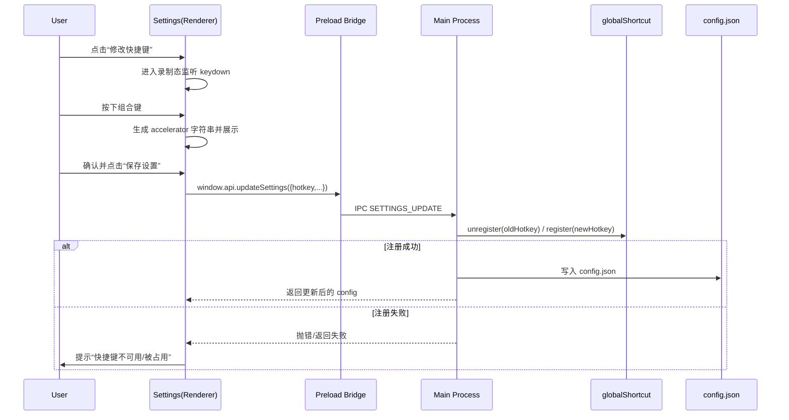

## 整体架构（数据流）

## 模块划分

- Renderer（设置页）
  - 展示当前快捷键
  - 提供“录制态”捕获键盘输入，生成 accelerator
  - 保存时把 `hotkey` 与其它设置一起提交
- Main（主进程）
  - 负责 `config.json` 读写
  - 负责全局快捷键注册/回滚与托盘提示更新
- Preload（桥接）
  - 维持已有 API，不新增权限能力

## 快捷键编码约定

- 使用 Electron accelerator 字符串：
  - 单键：`F1`、`PrintScreen`（若平台支持）
  - 组合键：`Ctrl+Shift+A`、`Alt+X`
- 录制态规则：
  - 仅按下修饰键（Ctrl/Alt/Shift/Meta）不产生结果
  - 按 `Escape` 退出录制态不修改
  - 产生结果后由用户点击“应用”确认写入表单

## 接口契约

- `window.api.getSettings(): Promise<AppConfig>`
- `window.api.updateSettings(patch: Partial<AppConfig>): Promise<AppConfig>`
  - 当 patch 含 `hotkey`：
    - 主进程尝试注册新快捷键，成功则持久化并返回新 config
    - 失败则拒绝保存并抛出错误（渲染进程显示错误提示）

## 异常处理策略

- 无效 accelerator：渲染端在录制态就不允许确认应用；保存时二次校验。
- 注册失败：主进程回滚到旧快捷键并向渲染端报错；托盘提示保持一致。

