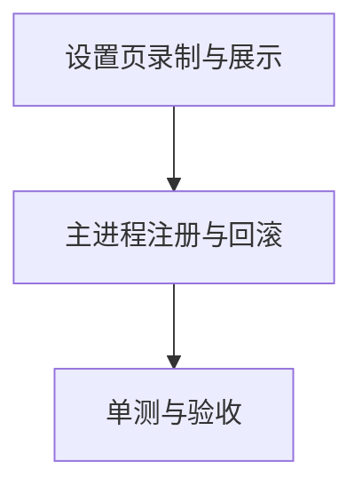

## 任务拆分

### T1：设置页快捷键录制与展示

- 输入契约
  - 已存在 `window.api.getSettings/updateSettings`
  - 现有设置页使用 AntD Form
- 输出契约
  - 设置页支持显示/录制/应用快捷键
  - 保存时向主进程提交 `hotkey`
- 实现约束
  - 生成 Electron accelerator 字符串
  - 不引入新依赖

### T2：主进程 hotkey 读取、保存、注册与回滚

- 输入契约
  - `config.json` 现为 `AppConfig` 结构
  - `registerShortcuts()` 当前强制写回 F1
- 输出契约
  - `loadConfig()` 从文件加载 hotkey（无效则回落）
  - `SETTINGS_UPDATE` 允许更新 hotkey，并在注册失败时回滚
  - 托盘提示展示当前 hotkey
- 实现约束
  - 避免 `globalShortcut.unregisterAll()` 误伤会话内快捷键

### T3：单测与验收

- 输入契约
  - 项目使用 Vitest
- 输出契约
  - 对“键盘事件 → accelerator”的纯函数做单测
  - 运行 `pnpm test` 通过

## 任务依赖图

