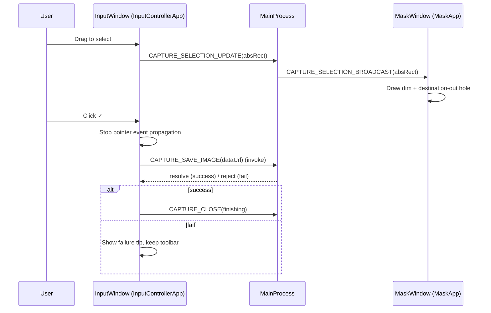

# Transparent Selection + Confirm Close - Design

## Components
- **Input Controller (renderer)**: `src/renderer/pages/capture/InputControllerApp.tsx`
  - Owns selection state machine (selecting → pending-confirm).
  - Renders ✓/✕ toolbar.
  - Crops from compositeCanvas and invokes main-process save via IPC.
- **Mask (renderer)**: `src/renderer/pages/mask/MaskApp.tsx`
  - Draws dim overlay + transparent hole using `destination-out`.
- **Main (electron main process)**: `src/main/index.ts`
  - Handles `CAPTURE_SAVE_IMAGE` (writes clipboard, optional file save).
  - Handles `CAPTURE_CLOSE` (closes mask/input windows).

## Interaction Flow

## Error Handling Strategy
- **Save success**: request close immediately after IPC invoke resolves.
- **Save failure**: do not close; surface a short tip text; allow retry/cancel.

## Non-Goals
- No changes to capture image composition.
- No changes to mask rendering algorithm beyond ensuring the hole stays transparent.
