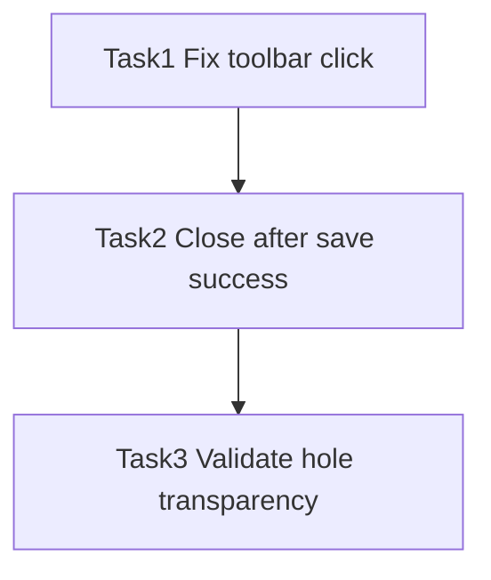

# Transparent Selection + Confirm Close - Tasks

## Task 1: Fix ✓/✕ click not restarting selection
- **Input**: `InputControllerApp` root pointer handlers and toolbar buttons.
- **Output**: Clicking ✓/✕ does not trigger root `onPointerDown` selection logic.
- **Acceptance**: Click ✓/✕ works reliably without changing selection state unexpectedly.
- **Constraint**: Keep current pointer-drag behavior unchanged elsewhere.

## Task 2: Close only after save success
- **Input**: Confirm flow in `InputControllerApp` and IPC `saveImage` invoke.
- **Output**: Only call `requestClose(finishing)` after save resolves; on error keep UI open.
- **Acceptance**: Simulated save failure leaves overlay open and shows a tip.

## Task 3: Validate transparent selection hole
- **Input**: `MaskApp` draw loop.
- **Output**: Hole remains transparent during drag and pending-confirm.
- **Acceptance**: Selected region shows desktop without dim overlay.

## Task Dependency

